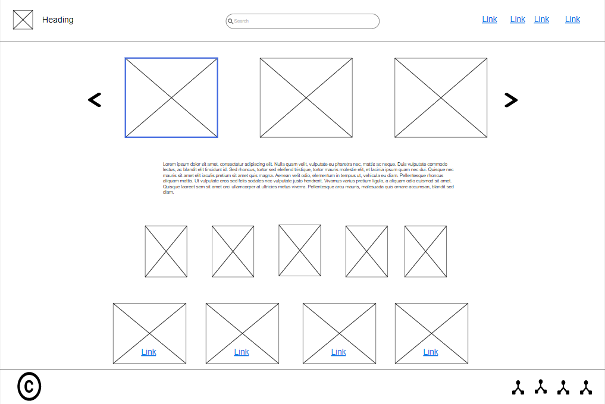
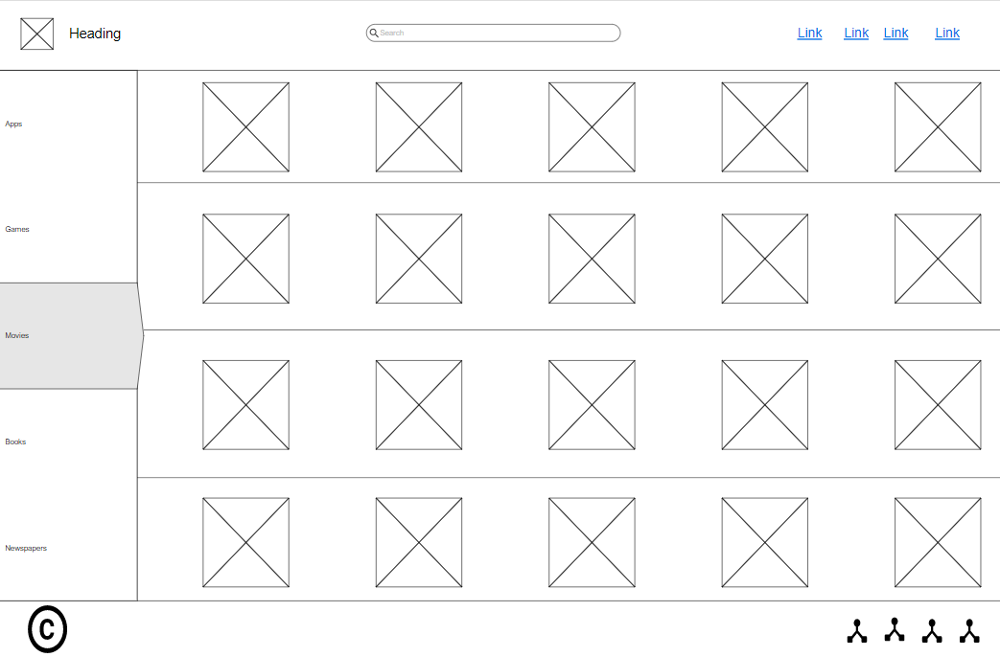
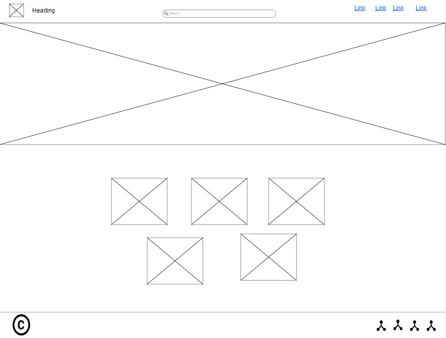
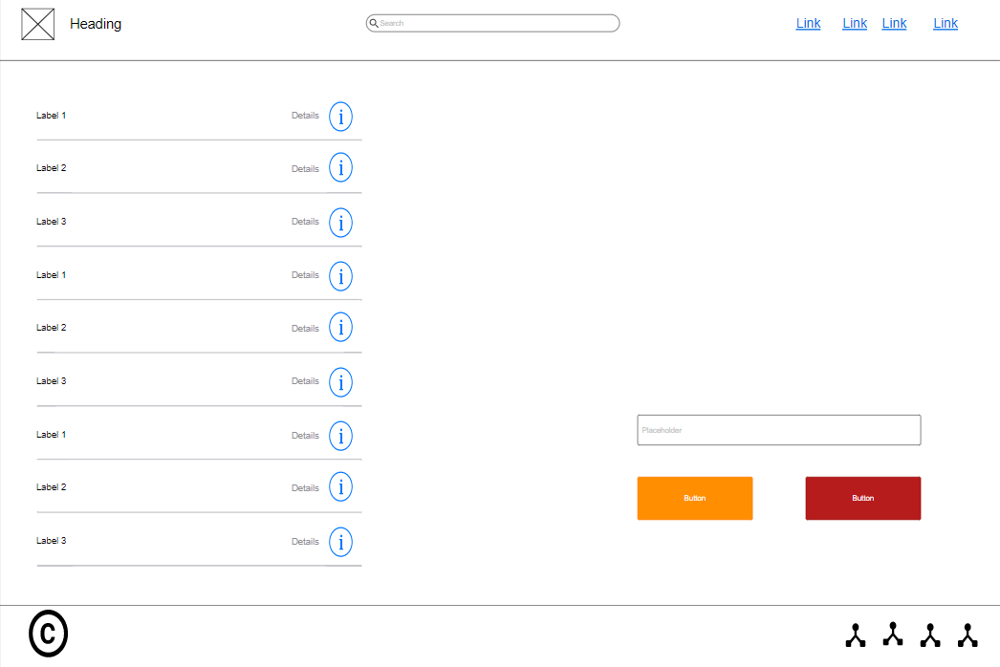

# Hand2Hand
BETC Assignment

## The organization name: `SAD.co` (Software  Application Development).
## The Team name : Hephaestus
## Team Leader: Zaid Shishani
## Team members: 
1. Ahmad Abulaban
2. Mohammad Abdul Ghafour
3. Saif K Saeed
4. Ahmad AbuRumuh

***

# WireFrame:

### We prepared a base wireframe for our webpages on the weekend. We used moqups to draw out our webpages so we can use them as references when building our webpages. 

## Wireframe images:

* Home Page

* Store page

* About Us page

* Cart page

***

# Problem domain:

| probems     |
| ----------- | 
| 1. Society does not have a platform for handicraft makers | 
| 2. Difficulty in delivering products on time  | 
| 3. The product cannot be traced back to the customer | 
| 4. Difficulty marketing their products  | 
| 5. Between the vendor and the customer, there is a lack of confidence. | 
| 6. The difficulty of knowing the prices of products without the need to reach out seller. | 
| 7. Not knowing if the product is available or not. | 

***
***

# App Info

**This application helps the owners of handicrafts to display their products and their business to reach customers in an easy, safe and fast way. The application provides them with many advantages, including the delivery of products from the seller to the customer, in addition to providing the order tracking feature. It provides marketing feature at nominal prices.**

# Reference:
* [About Us Banner CSS](https://codepen.io/ZachSaucier/pen/RwVdEJO)
* [moqups](https://my.moqups.com/login)
* [Github](https://github.com/)

***

### version of product: 0.0.17